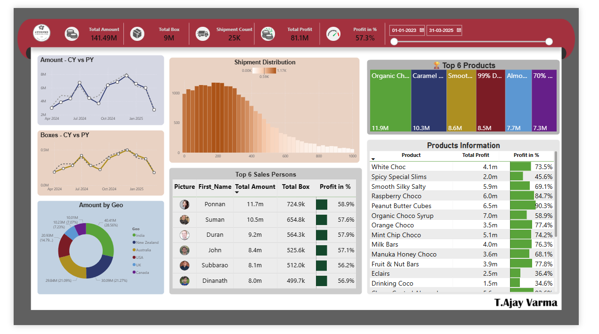

# chocolate-sales-PowerBi-dashboard
Power BI dashboard analyzing sales, profit, shipments, and performance by country, product, and salesperson. Includes star schema data modeling, DAX measures, and interactive visuals for business insights.
# 🍫 Chocolate Sales Dashboard (Power BI)

## 📌 About the Project
This project is a Power BI dashboard built to analyze chocolate sales data.  
The goal was to understand how the business is performing in terms of sales, profit, shipments, and product performance.

I worked with multiple datasets and combined them to create a single interactive dashboard that gives a complete view of the business.

---
## 📸 Dashboard Preview

---
## 📊 What This Dashboard Shows
- Overall sales and profit performance  
- Number of shipments and boxes sold  
- Sales trends over time (current year vs previous year)  
- Top-performing products  
- Salesperson performance  
- Country-wise sales distribution  
- Product-wise profit percentage  

---

## 📈 Key Highlights
- Total Sales: 141.49M  
- Total Profit: 81.1M  
- Profit Percentage: 57.3%  
- Total Shipments: 25K  

---

## 🧠 What I Learned
While working on this project, I learned:
- How to clean and transform data using Power Query  
- How to build relationships between multiple tables (data modeling)  
- Writing DAX measures for KPIs like profit %  
- Designing a dashboard that is easy to understand and interactive  

---

## ⚙️ Tools Used
- Power BI  
- Power Query  
- DAX  
- Excel  

---

---

## 📁 Project Structure
Telugu-Full-Course-Project/  
│  
├── Data/  
├── PBIX/  
├── Images/  
└── README.md  

---

## 🚀 How to Use
1. Download the https://github.com/AjayVarma03/chocolate-sales-PowerBi-dashboard/blob/main/PBIX/Chocolets-Sales-Dashboard.pbix file  
2. Open it in Power BI Desktop  
3. Explore the dashboard using filters and visuals  

---

## 💡 Key Observations
- A few products contribute to a large share of total sales  
- Profit margins are different across products  
- Some regions perform better than others  
- Top salespersons consistently generate high revenue  

---

## 🙌 Author
Ajay Varma
